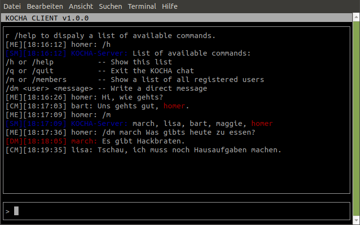

# kocha: a multi client chat application for the linux console



## Installation

```console
git clone https://github.com/f1nan/kocha.git
cd kocha/
make install
```

## Create a kocha.server

```console
python3 -m kocha.server HOST PORT
```

## Connect kocha.client to a kocha.server instance

```console
python3 -m kocha.client HOST PORT
```
